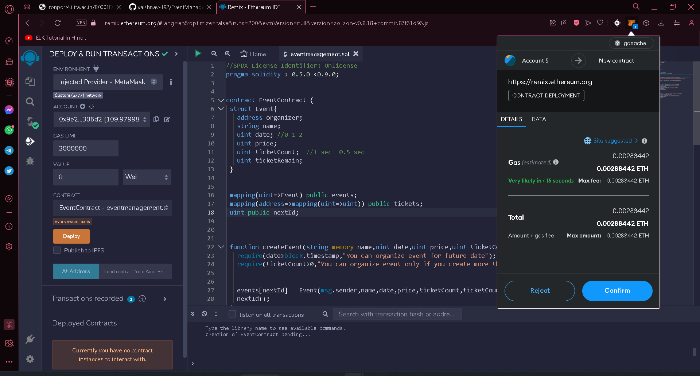
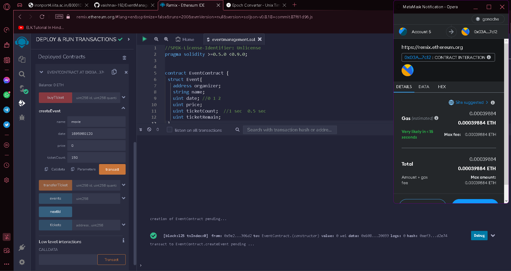
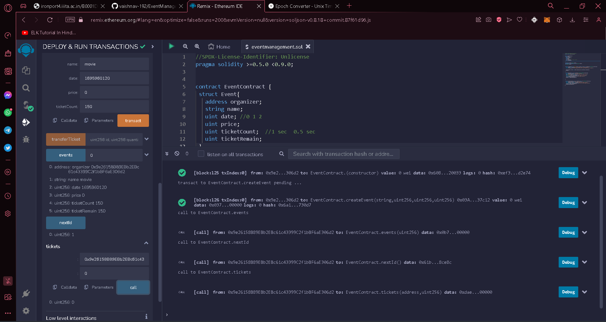
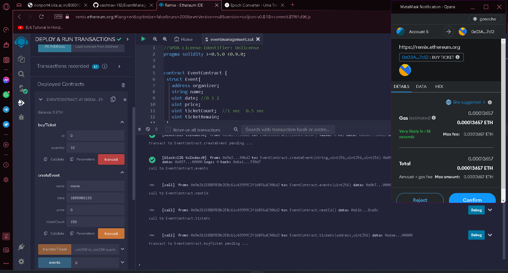
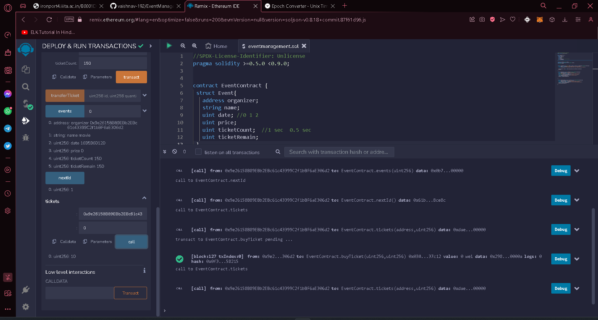

# EventManagement
Welcome To README.md!! 
This is a Smart Contract, used to create events and users can buy tickets.

  <ul>
    <li>deploying Smart Contract on Online Remix IDE. Before deploying make sure you had connected your metamast wallet to remix

    
  </li>
  <li>Creating Event on Smart Contract (make sure ti input date in terms of timestamp and price in terms of Ether)

  
  </li>
  <li>
    We can see details of the event:

  
  </li>
  <li>
    Buying tickets

  
  </li>
  <li>
    Details after buying tickets, we can see that umber of seats available are decreased.

  
  </li>
  <li>similarly we can transfer tickets from one accuont to another account(via its public address)</li>
  </ul>

